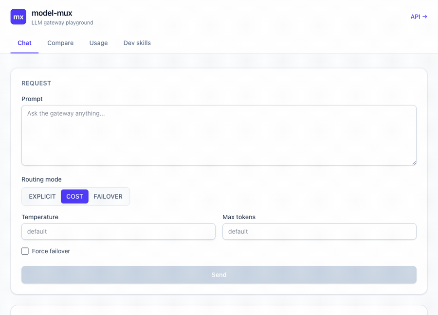
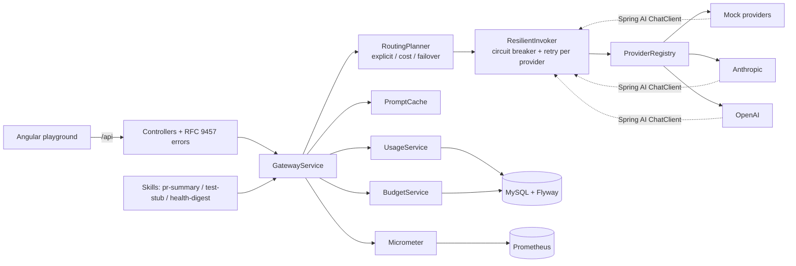

# model-mux

[](https://github.com/rafaelinfante/model-mux/actions/workflows/ci.yml)
[](https://github.com/rafaelinfante/model-mux/actions/workflows/codeql.yml)
[](LICENSE)


An LLM **gateway** that puts Anthropic and OpenAI behind one API (via Spring AI) and adds the
production concerns a real gateway needs — cost-aware routing, per-provider failover, token/cost
budgets, caching, rate limiting, streaming, and observability — plus three AI-augmented developer
skills I actually use day to day.



I build payment gateways for a living: one clean API in front of many third-party providers, each
with its own quirks, failures, and costs. An LLM gateway is the same discipline pointed at a newer
class of provider. The interesting part isn't calling a model — Spring AI does that — it's everything
that has to be true around the call before you'd put it in production.

> Runs with **no API keys**. Two built-in mock providers (a fast/cheap one and a slow/premium one)
> let you see routing, failover, and the cost meter work end to end. Add a key to light up the real
> providers.

## What it does

- **One API over many providers.** Every provider — the mocks, Anthropic, OpenAI — is a Spring AI
  `ChatModel` behind a single `LlmProvider` contract, so the caller never knows or cares who answered.
- **Three routing modes.** `EXPLICIT` (you name the provider), `COST` (prompt complexity picks cheap
  vs premium), and `FAILOVER` (try providers in order, fall through on transient failure) — each with
  a **Resilience4j circuit breaker and retry per provider**.
- **"Ask both" compare.** Sends one prompt to every provider at once on **virtual threads** and
  returns the answers side by side with each one's tokens, cost, and latency.
- **Token and cost governance.** Reads the real token usage off each response, prices it from a
  configurable table, and enforces a **per-client daily budget** (reject, or auto-downgrade to the
  cheap tier). Usage aggregates are queryable and exported to Prometheus.
- **Caching, rate limiting, streaming.** Identical prompts are served from an in-memory cache at zero
  token cost; each client is rate-limited; completions can stream over SSE.
- **Three AI-augmented dev skills**, each a thin layer over the gateway:
  - **PR summary** — an LLM review (summary, risk flags, test gaps as *structured* output) **plus a
    deterministic Google Java Format check reported alongside.** The model handles judgment; a tool
    handles formatting. Never ask the model to do what a tool does exactly.
  - **Test-stub generator** — drafts a JUnit 5 skeleton (nested cases, edge cases) for a class.
  - **Health digest** — turns a sample of system metrics into a plain-English daily summary.

## Architecture



The gateway call sits **outside** any database transaction — two short transactions bracket it — so a
slow third party never holds a row lock. Resilience lives in one place (Resilience4j); Spring AI's own
retry is turned off so there's a single, observable source of truth.

## Run it in 30 seconds

```bash
docker compose up --build
```

- Playground: <http://localhost:8088>
- API docs (Swagger UI): <http://localhost:8080/swagger-ui.html>
- Metrics: <http://localhost:8080/actuator/prometheus>

```bash
curl -s localhost:8080/api/chat -H 'content-type: application/json' \
  -d '{"prompt":"Explain idempotency keys in one sentence.","mode":"COST"}' | jq
```

```jsonc
{
  "content": "...",
  "provider": "mock-fast",
  "model": "mux-mini",
  "tier": "CHEAP",
  "routeMode": "COST",
  "promptTokens": 12,
  "completionTokens": 34,
  "totalTokens": 46,
  "costUsd": 0.000037,
  "latencyMs": 104,
  "cacheHit": false,
  "failedOver": false,
  "correlationId": "..."
}
```

Force a failover and watch it fall through to the next provider:

```bash
curl -s localhost:8080/api/chat -H 'content-type: application/json' \
  -d '{"prompt":"hi","mode":"FAILOVER","forceFailover":true}' | jq '{provider, failedOver}'
```

## API overview

| Method & path | What it does |
|---|---|
| `POST /api/chat` | Route + complete one prompt (`mode`: `EXPLICIT` / `COST` / `FAILOVER`) |
| `POST /api/chat/stream` | The same, streamed over SSE |
| `POST /api/compare` | Send one prompt to every provider, answers side by side |
| `GET /api/providers` | List the registered providers |
| `GET /api/usage?hours=24` | Usage aggregates + this client's budget |
| `POST /api/skills/pr-summary` | LLM PR review + deterministic style check |
| `POST /api/skills/test-stub` | JUnit 5 test skeleton for a class |
| `POST /api/skills/health-digest` | Plain-English summary of metrics |

`X-Client-Id` sets the budget/rate-limit identity (defaults to `anonymous`); every response carries an
`X-Correlation-Id`.

## Enabling the real providers

```bash
cp .env.example .env
# set MODELMUX_ANTHROPIC_ENABLED=true and MODELMUX_ANTHROPIC_API_KEY=...
#  and/or MODELMUX_OPENAI_ENABLED=true and MODELMUX_OPENAI_API_KEY=...
docker compose up --build
```

A provider only joins the registry when it's enabled *and* a key is present; otherwise the gateway
boots on the mocks alone. The gateway constructs the provider models itself, so a missing key never
breaks startup.

## Design decisions

- **Why Spring AI.** I've built my own provider-abstraction layer before (it's exactly the adapter
  pattern I use for payment gateways). Here the abstraction is a solved problem, so I used the
  framework for the plumbing and spent the effort on the layer that's actually worth money: routing,
  resilience, budgets, caching, and observability.
- **Why a stable stack (Spring Boot 3.5 + Spring AI 1.1, not Boot 4 / Spring AI 2.0).** Both majors
  had only just gone GA when I built this. For a reference repo meant to clone-and-run cleanly for
  months, I'd rather run the battle-tested release than the days-old one. I stay current; I just don't
  put bleeding-edge in a system whose job is to be reliable.
- **Why the style check is deterministic.** Google Java Format gives the exact same answer every time
  and can't hallucinate. The LLM is for the judgment a formatter can't make (is this change risky?).
  Mixing the two — and being clear which is which — is the whole point of the PR skill.
- **Transient vs terminal failures.** A timeout, a 429, or a 5xx is transient: retry, then fail over,
  and count it against the breaker. A model declining or a 400 is a *result*, not an outage — it
  doesn't trip anything.

## Testing

```bash
cd backend
mvn test     # fast unit tests, no Docker
mvn verify   # adds the Testcontainers integration suite (real MySQL 8)
```

Unit tests cover the routing, cost, cache, and style-check logic. The integration suite drives the
real HTTP API against a MySQL container — routing, forced failover, cache hits, budget rejection,
compare, streaming, and all three skills end to end.

## Roadmap

- More providers (Gemini, a local Ollama) — the registry already makes this additive.
- Semantic cache (embedding-based) instead of exact-match.
- Prompt templates with versioning.
- Per-client API keys and auth on the gateway itself.
- OpenTelemetry traces alongside the Prometheus metrics.

## Tech stack

**Backend** — Java 21, Spring Boot 3.5, Spring AI 1.1 (Anthropic + OpenAI), Resilience4j, Spring Data
JPA, MySQL 8 + Flyway, Caffeine, springdoc-openapi, Micrometer/Prometheus, google-java-format, JTokkit.
**Frontend** — Angular 22 (standalone, signals, zoneless) + Tailwind CSS v4. **Build & quality** —
Maven, JUnit 5, Mockito, AssertJ, Testcontainers, JaCoCo, Docker Compose, nginx, GitHub Actions,
CodeQL, Dependabot.
